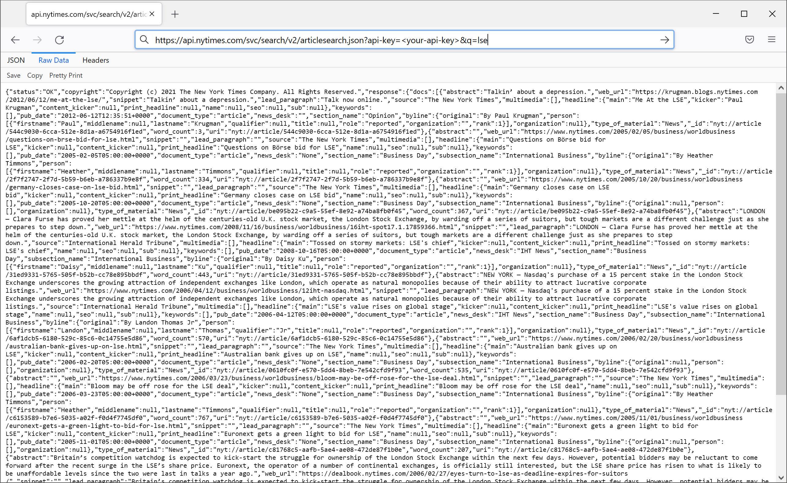
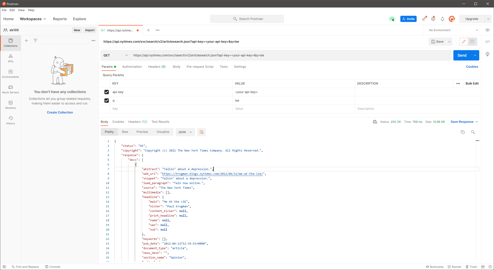
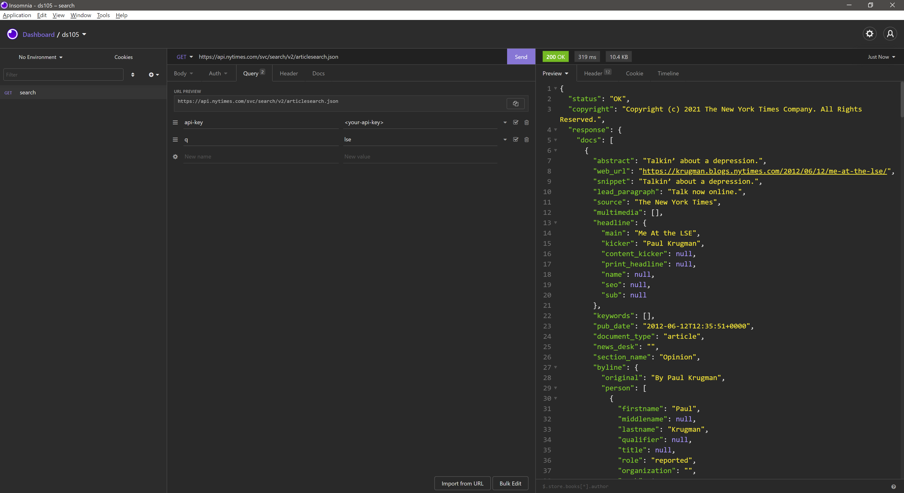

# How to make Http API calls

In this guide, we will use the NYTime's search API to practice making Http API calls. Note that you should always replace `<your-api-key>` with your own api-key from NYTimes account.

## Using CLI

### Make request

One of the most well-known cli tools to make http requests is `curl`.

```bash
$ curl --request GET \
  --url 'https://api.nytimes.com/svc/search/v2/articlesearch.json?api-key=<your-api-key>&q=lse'

{"status":"OK","copyright":"Copyright (c) 2021 The New York Times Company. All Rights Reserved.","response":{"docs":[{"abstract":"Talkin’ about a depression.","web_url":
...
```

### Save response to a file

By default, the response will be printed on standard output. So if the response is very big, then there might be performance issue with your cli interface. Also, the response data is not persistent in this way.

A better approach is to save the response in a file:

```bash
$ curl --request GET \
  --output res.json \
  --url 'https://api.nytimes.com/svc/search/v2/articlesearch.json?api-key=<your-api-key>&q=lse'

   % Total    % Received % Xferd  Average Speed   Time    Time     Time  Current
                                 Dload  Upload   Total   Spent    Left  Speed
100 10658  100 10658    0     0  15291      0 --:--:-- --:--:-- --:--:-- 15269
```

The `--output res.json` options will save the output to file `res.json`.

Alternatively, you can use bash redirections:

```bash
$ curl --request GET \
  --url 'https://api.nytimes.com/svc/search/v2/articlesearch.json?api-key=<your-api-key>&q=lse' > res.json

  % Total    % Received % Xferd  Average Speed   Time    Time     Time  Current
                                 Dload  Upload   Total   Spent    Left  Speed
100 10658  100 10658    0     0  19627      0 --:--:-- --:--:-- --:--:-- 19591
```

The `> res.json` command will redirect the output into `res.json`. Note that if the file already exists, this will replace all existing content. To preserve existing content and append new data, use double angle brackets: 
`>> res.json`

### View response

To view the response content:

```bash
$ cat res.json

{"status":"OK","copyright":"Copyright (c) 2021 The New York Times Company. All Rights Reserved.","response":{"docs":[{"abstract":"Talkin’ about a depression.","web_url"

...
```

Or if the content is very big:

```
$ cat res.json | less
```

Or simply:

```bash
$ less res.json
```

The json response of NYTime API has been compresed so there isn't any format which makes it difficult to read. There are many ways to make the content human-readable. For example, we can use python's `json.tool` to format the response:

```bash
$ cat res.json | python3 -m json.tool | less

{
    "status": "OK",
    "copyright": "Copyright (c) 2021 The New York Times Company. All Rights Reserved.",
    "response": {
        "docs": [
            {
                "abstract": "Talkin\u2019 about a depression.",
                "web_url": "https://krugman.blogs.nytimes.com/2012/06/12/me-at-the-lse/",
                "snippet": "Talkin\u2019 about a depression.",
                "lead_paragraph": "Talk now online.",
                "source": "The New York Times",
                "multimedia": [],
                "headline": {
                    "main": "Me At the LSE",
                    "kicker": "Paul Krugman",
                    "content_kicker": null,
                    "print_headline": null,
                    "name": null,
                    "seo": null,
                    "sub": null
...
```
 

## Using applications wih GUI

### Web browser

For a http `GET` request with only query params, you can simply call it using your web browser.




### API develop tools

There are also many API develop and testing tools, which are usually used by web developers. These tools always come with GUI making it easy to use.

### [Postman](https://www.postman.com/)



### [Insomnia](https://insomnia.rest/)



## Programmatically

### Python

```python
import requests

# Replace <your-api-key> with your api key

res = requests.request(
    'GET',
    'https://api.nytimes.com/svc/search/v2/articlesearch.json',
    params={
        'api-key': '<your-api-key>',
        'q': 'lse'
    }
)

print(res.content)

```
