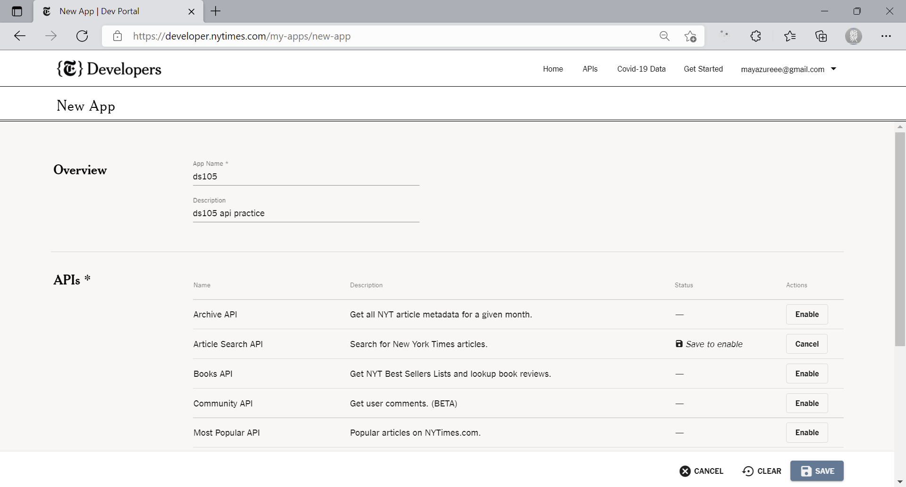

# New York Times API

This is a guide of using New York Times APIs.

## Create an account

To create an account, go to [NYTime's developer website](https://developer.nytimes.com/accounts/create) and follow the instruction to fill in the creation form and validate your email.

## Create an app

Once your account is activated, go to [My apps](https://developer.nytimes.com/my-apps) page. Click the `New App` button on top right.


You will be redirect to the new app creation page.



Fill in `App Name` and `Description` field. 

Then, in APIs panel, select the APIs that you want to use. For example, we will enable the `Article search` API in this guide.

Click save, and you will get an APP ID and API Keys info.


The key is the most important info on this page, and you will need it for all API requests.

You can also add new keys or revoke a key in this panel.

**Be aware that anyone with the key can access the api.**

## Make API requests

We will now use the article search api as an example to demonstrate how to use NYTime's apis.

Note that this is a guide of NYTime's api. For instruction of making a general API call please refer to `How to make Http API calls` 

### Read documentations

Reading API documentation is always the first thing to do whenever you use a API. NYTime have a well-maintained documentation. For example the [article search api documentation](https://developer.nytimes.com/docs/articlesearch-product/1/overview).

You can find the API url and all related parameters on this documentation as well as working examples.

### A example

The url for article search api is:

```
https://api.nytimes.com/svc/search/v2/articlesearch.json
```

According to the documentation, to search for articles, you need to add a `q` query parameter and a `api-key` query parameter to the url:

```
https://api.nytimes.com/svc/search/v2/articlesearch.json?q=lse&api-key=<your-api-key>
```

Note that the `?` split url and query parameters and `&` split different query parameters. For a better understanding of url format, please read [*What is a URL?*](https://developer.mozilla.org/en-US/docs/Learn/Common_questions/What_is_a_URL).

So the above url will search articles that contain keyword `lse`.

You can also filter results by adding filter parameters `fq`. For example:

```
https://api.nytimes.com/svc/search/v2/articlesearch.json?q=lse&api-key=<your-api-key>&fq=news_desk:("Sports" "Foreign")
```

This will only show results whose value of `news_desk` field is either `Sports` or `Foreign`

For a full list of record fields, filters and allowed values, please refer to the `Filter Query Fields` and `Schema` part of the documentation.

Different apis may have different structures and thie structures could be very complex. Therefore, it's always very important to read api documentations.

### NYTimes API online testing tool

NYTimes API website provides a very useful online testing tool so you can understand their api structure more easily.

On the left panel, click on the `PATHS` item.


Then click on the `AUTHORIZE` button on top right. Select your app, click `AUTHORIZE` and `ok`.


Then you can try the api using this online tool by adding or selecting values on the left panel. Click `EXECUTE` to make the call.


You may also find generated codes for other tools or programming languages. These code are ready to execute. 

For example, copy the cURL command to a cli:

```bash

# Replace [YOUR_API_KEY] with your api key

$ curl \
  'https://api.nytimes.com/svc/search/v2/articlesearch.json?q=lse&sort=oldest&api-key=[YOUR_API_KEY]' \
  --header 'Accept: application/json' \
  --compressed

  {"status":"OK","copyright":"Copyright (c) 2021 The New York Times Company. All Rights Reserved.","response":{"docs":[{"abstract":"Much excitement was created in Davenport, Muscatine, Iowa City and intermediate points yesterday, by the reports in relation to serious and fatal disturbances in Keokuk County. We have endeavored to obtain a correct statement of the facts and give them as near as can be ascertained at present writing, as follows:  ","web_url"
  ...
```